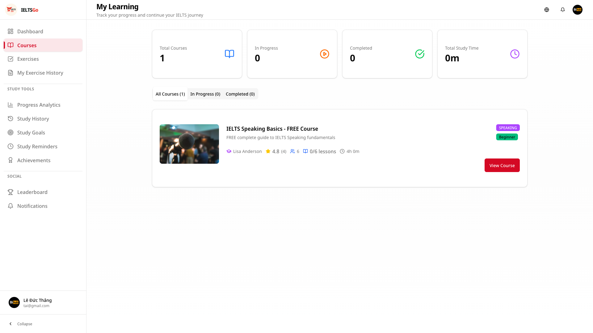
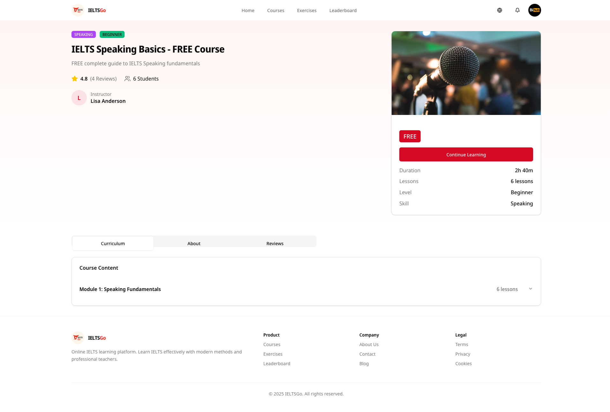
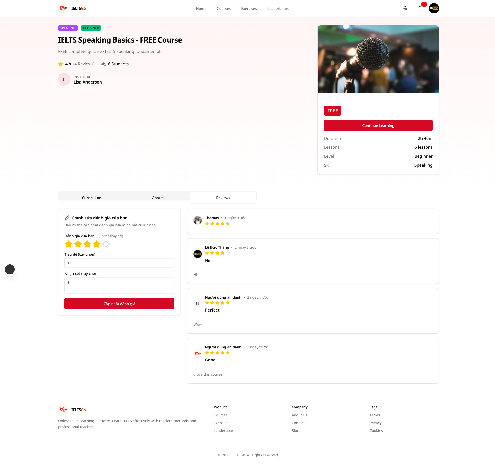
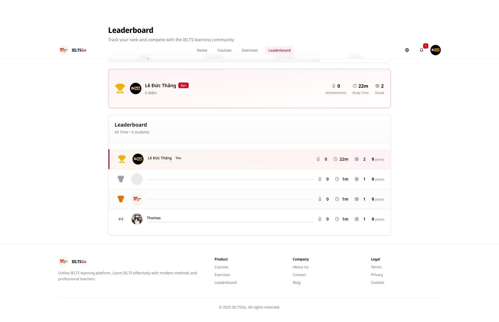
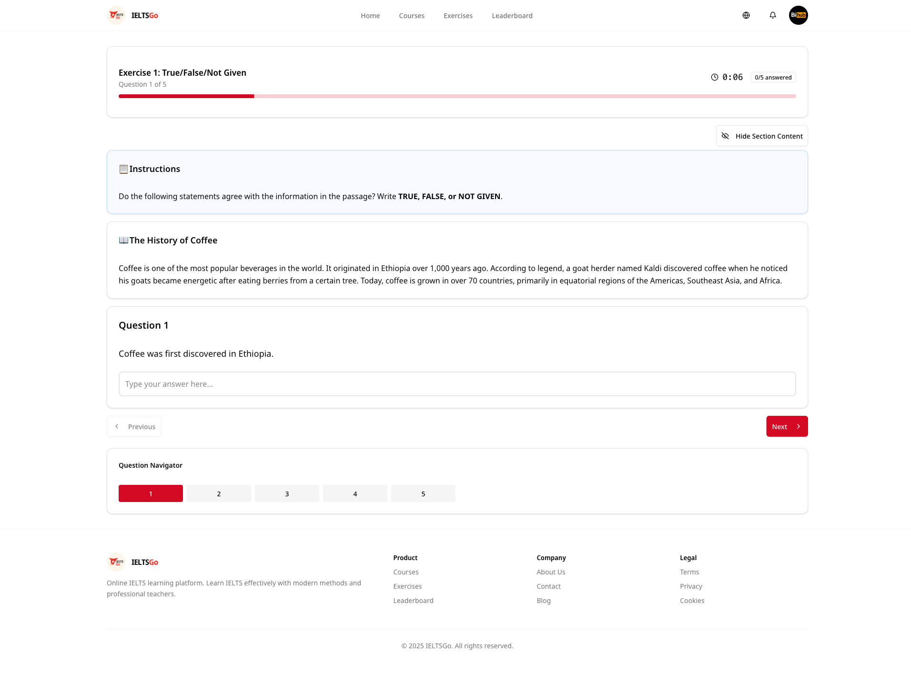
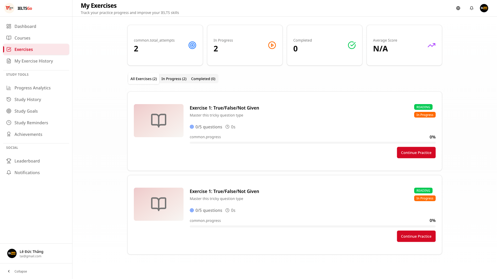

# 📸 Kịch Bản Demo Hệ Thống IELTSGo

> **Mục đích**: File hướng dẫn chi tiết để chụp ảnh demo cho báo cáo
> 
> **Thời gian ước tính**: 60-90 phút để demo toàn bộ hệ thống
> 
> **Tài khoản cần chuẩn bị**:
> - 1 tài khoản Student (để demo các tính năng học viên)
> - 1 tài khoản Instructor (để demo tính năng giảng viên)
> - 1 tài khoản Admin (để demo tính năng quản trị)

---

## 📋 Checklist Tổng Quan

### Student Flow (Chính)
- [ ] 1. Trang chủ (Homepage)
- [ ] 2. Đăng ký / Đăng nhập
- [ ] 3. Dashboard
- [ ] 4. My Courses
- [ ] 5. Courses Browse
- [ ] 6. Course Detail
- [ ] 7. Lesson Detail (Video player)
- [ ] 8. Exercises List
- [ ] 9. Exercise Detail
- [ ] 10. Take Exercise
- [ ] 11. Exercise Result
- [ ] 12. My Exercises
- [ ] 13. Exercise History
- [ ] 14. Progress Analytics
- [ ] 15. Goals
- [ ] 16. Reminders
- [ ] 17. Achievements
- [ ] 18. Notifications
- [ ] 19. Leaderboard
- [ ] 20. Profile
- [ ] 21. Settings
- [ ] 22. User Profile (public)

### Instructor Flow
- [ ] 23. Instructor Dashboard
- [ ] 24. Instructor Courses
- [ ] 25. Create Course
- [ ] 26. Edit Course
- [ ] 27. Instructor Exercises
- [ ] 28. Create/Edit Exercise
- [ ] 29. Students Management
- [ ] 30. Messages
- [ ] 31. Analytics

### Admin Flow
- [ ] 32. Admin Dashboard
- [ ] 33. User Management
- [ ] 34. Content Management
- [ ] 35. Analytics
- [ ] 36. Notifications
- [ ] 37. System Settings

---

## 🎬 KỊCH BẢN DEMO CHI TIẾT

### PHẦN 1: TRANG CHỦ VÀ XÁC THỰC (15 phút)

#### 📸 Screenshot 1.1: Homepage - Không đăng nhập
**URL**: `http://localhost:3000/`


**Mô tả**:
- Hero section với branding IELTSGo
- Features grid (4 cards)
- Stats section
- Why Choose section
- Testimonials section
- CTA section

**Hành động**:
1. Mở trang chủ
2. Scroll xuống để xem các sections
3. **Chụp**: Full page hoặc từng section

**Lưu ý**: Nếu đã đăng nhập, content sẽ khác (có nút "Go to Dashboard")

---

#### 📸 Screenshot 1.2: Homepage - Đã đăng nhập
**URL**: `http://localhost:3000/` (khi đã login)


**Mô tả**:
- Hero section với greeting personal
- Các nút quick action (Dashboard, My Courses, Practice Exercises)

**Hành động**:
1. Đăng nhập vào hệ thống
2. Quay về trang chủ
3. **Chụp**: Hero section với personalized greeting

---

#### 📸 Screenshot 1.3: Đăng ký (Register)
**URL**: `http://localhost:3000/register`


**Mô tả**:
- Form đăng ký với validation
- EnhancedFormField với validation states
- Email, Password, Confirm Password, Full Name fields
- "Sign up" button

**Hành động**:
1. Truy cập `/register`
2. Điền form (có thể test validation)
3. **Chụp**: Form đăng ký

**Lưu ý**: Nếu cần demo validation, thử submit với form trống hoặc email không hợp lệ

---

#### 📸 Screenshot 1.4: Đăng nhập (Login)
**URL**: `http://localhost:3000/login`


**Mô tả**:
- Form đăng nhập
- EnhancedFormField
- "Sign in" button
- Link "Don't have an account? Register"

**Hành động**:
1. Truy cập `/login`
2. Đăng nhập với tài khoản Student
3. **Chụp**: Form đăng nhập

**Sau khi đăng nhập**: Sẽ redirect đến `/dashboard`

---

### PHẦN 2: DASHBOARD VÀ OVERVIEW (10 phút)

#### 📸 Screenshot 2.1: Dashboard - Overview Tab
**URL**: `http://localhost:3000/dashboard`


**Mô tả**:
- PageHeader với welcome message và time range filters
- Quick Action Cards (4 cards với gradient):
  - Explore Courses
  - Practice Exercises
  - View Progress
  - Set Goals
- Stats Grid:
  - Total Study Time
  - Exercises Completed
  - Average Score
  - Day Streak
- Progress Charts (3 tabs):
  - Study Time
  - Completion Rate
  - Exercises by Type
- Skill Progress Cards (Listening, Reading, Writing, Speaking)
- Activity Timeline

**Hành động**:
1. Sau khi đăng nhập, tự động redirect đến dashboard
2. Scroll để xem tất cả sections
3. Thử thay đổi time range filter (7d, 30d, 90d, All Time)
4. Thử switch giữa các tabs trong Progress Charts
5. **Chụp**: 
   - Full dashboard (scroll capture)
   - Quick actions cards (close-up)
   - Stats grid
   - Progress charts với data

**Lưu ý**: Đảm bảo có data để charts hiển thị đẹp

---

### PHẦN 3: COURSES - KHÓA HỌC (20 phút)

#### 📸 Screenshot 3.1: My Courses - Tab "All"
**URL**: `http://localhost:3000/my-courses`


**Mô tả**:
- PageHeader với "My Courses" title
- Tabs: All, In Progress, Completed, Not Started
- Grid các course cards (nếu có)
- EmptyState nếu chưa có course

**Hành động**:
1. Truy cập `/my-courses`
2. **Chụp**: Trang với courses (hoặc EmptyState nếu chưa có)

---

#### 📸 Screenshot 3.2: My Courses - Tab "In Progress"
**URL**: `http://localhost:3000/my-courses`



**Hành động**:
1. Click tab "In Progress"
2. **Chụp**: Courses đang học

---

#### 📸 Screenshot 3.3: Browse Courses
**URL**: `http://localhost:3000/courses`


**Mô tả**:
- PageHeader "Explore Courses"
- Course Filters Component:
  - Skill Type filter
  - Level filter
  - Enrollment Type filter
  - Featured courses checkbox
  - Search bar
- Grid course cards (SkeletonCard khi loading)
- EmptyState nếu không có kết quả
- Pagination

**Hành động**:
1. Truy cập `/courses`
2. Thử filter theo skill type (Listening, Reading, Writing, Speaking)
3. Thử search
4. Scroll để xem pagination
5. **Chụp**: 
   - Trang với filters
   - Grid courses
   - Close-up một course card

---

#### 📸 Screenshot 3.4: Course Detail - Curriculum Tab
**URL**: `http://localhost:3000/courses/[courseId]`


**Mô tả**:
- Course header với image, title, description
- Badges (skill type, level, enrollment type)
- Stats (students, rating, duration)
- Enroll/Continue button
- Tabs:
  - Overview
  - Curriculum (modules và lessons)
  - Reviews
- Progress indicator

**Hành động**:
1. Click vào một course từ `/courses`
2. Scroll để xem tất cả tabs
3. Click vào tab "Curriculum" để xem modules và lessons
4. **Chụp**: 
   - Course header
   - Curriculum với modules expanded
   - Reviews tab (nếu có)

---

#### 📸 Screenshot 3.6: Course Detail - About Tab
**URL**: `http://localhost:3000/courses/[courseId]`



**Hành động**:
1. Từ Course Detail, click tab "About"
2. **Chụp**: Course description và details

---

#### 📸 Screenshot 3.7: Course Detail - Reviews Tab
**URL**: `http://localhost:3000/courses/[courseId]`



**Hành động**:
1. Từ Course Detail, click tab "Reviews"
2. **Chụp**: Course reviews và ratings

---

#### 📸 Screenshot 3.8: My Courses - Completed Tab
**URL**: `http://localhost:3000/my-courses`



**Hành động**:
1. Click tab "Completed"
2. **Chụp**: Courses đã hoàn thành

---

#### 📸 Screenshot 3.5: Lesson Detail - Video Player
**URL**: `http://localhost:3000/courses/[courseId]/lessons/[lessonId]`


**Mô tả**:
- Video player
- Lesson sidebar với:
  - All lessons trong course
  - Progress indicator
- Lesson content (description, materials)
- Notes section
- Navigation buttons (Previous/Next lesson)

**Hành động**:
1. Từ Course Detail, click vào một lesson
2. Play video (nếu có)
3. Scroll để xem sidebar
4. **Chụp**: 
   - Video player với sidebar
   - Notes section

---

### PHẦN 4: EXERCISES - BÀI TẬP (25 phút)

#### 📸 Screenshot 4.1: Exercises List
**URL**: `http://localhost:3000/exercises/list`


**Mô tả**:
- PageHeader "Exercises"
- Filters:
  - Skill Type
  - Difficulty
  - Search
- Grid exercise cards (SkeletonCard khi loading)
- EmptyState nếu không có

**Hành động**:
1. Truy cập `/exercises/list`
2. Thử filter theo skill và difficulty
3. **Chụp**: Grid exercises với filters

---

#### 📸 Screenshot 4.2: Exercise Detail
**URL**: `http://localhost:3000/exercises/[exerciseId]`


**Mô tả**:
- Exercise header với badges (skill, difficulty, type)
- Stats (questions, sections, time limit, passing score)
- Preview sections với:
  - Section number
  - Description
  - Question count
  - Time limit
  - Instructions
- "Start Exercise" button

**Hành động**:
1. Click vào một exercise từ list
2. Scroll để xem preview sections
3. **Chụp**: Exercise detail với sections preview

---

#### 📸 Screenshot 4.3: Take Exercise (Đang làm bài)
**URL**: `http://localhost:3000/exercises/[exerciseId]/take/[submissionId]`



**Mô tả**:
- Timer countdown
- Progress indicator
- Question navigation
- Current question với answer options
- Submit button

**Hành động**:
1. Click "Start Exercise"
2. Làm một vài câu hỏi
3. **Chụp**: 
   - Question screen với timer
   - Navigation sidebar

---

#### 📸 Screenshot 4.6: My Exercises - Completed Tab
**URL**: `http://localhost:3000/my-exercises`



**Hành động**:
1. Click tab "Completed"
2. **Chụp**: Exercises đã hoàn thành

---

#### 📸 Screenshot 4.4: Exercise Result
**URL**: `http://localhost:3000/exercises/[exerciseId]/result/[submissionId]`

**Mô tả**:
- Score overview
- Section scores breakdown
- Detailed results với:
  - Correct/Incorrect answers
  - Explanations
- Retry button

**Hành động**:
1. Sau khi submit exercise
2. Scroll để xem detailed results
3. **Chụp**: 
   - Score overview
   - Detailed breakdown

---

#### 📸 Screenshot 4.5: My Exercises
**URL**: `http://localhost:3000/my-exercises`


**Mô tả**:
- PageHeader "My Exercises"
- Tabs: All, In Progress, Completed, Not Started
- Submission cards với:
  - Exercise title
  - Status badge
  - Score (nếu completed)
  - Date
  - Actions (Continue/View Result)

**Hành động**:
1. Truy cập `/my-exercises`
2. Switch giữa các tabs
3. **Chụp**: 
   - Tab "In Progress"
   - Tab "Completed" với scores

---

#### 📸 Screenshot 4.6: Exercise History
**URL**: `http://localhost:3000/exercises/history`


**Mô tả**:
- List tất cả submissions đã làm
- Filter options
- Pagination

**Hành động**:
1. Truy cập `/exercises/history`
2. **Chụp**: History list

---

### PHẦN 5: PROGRESS & ANALYTICS (10 phút)

#### 📸 Screenshot 5.1: Progress Analytics
**URL**: `http://localhost:3000/progress`


**Mô tả**:
- PageHeader với time range filters (7d, 30d, 90d, All Time)
- Summary Stats Grid:
  - Total Study Time
  - Exercises Completed
  - Average Score
  - Day Streak
- Tabs:
  - Study Time (chart)
  - Completion Rate (chart)
  - Exercises (breakdown by type)

**Hành động**:
1. Truy cập `/progress`
2. Thử thay đổi time range
3. Switch giữa các tabs
4. **Chụp**: 
   - Stats grid
   - Study Time chart
   - Completion Rate chart
   - Exercises breakdown

---

#### 📸 Screenshot 5.2: Study History
**URL**: `http://localhost:3000/history`


**Mô tả**:
- Timeline của các hoạt động học tập
- Filters (type, date range)

**Hành động**:
1. Truy cập `/history`
2. **Chụp**: Timeline với activities

---

### PHẦN 6: GOALS & REMINDERS (10 phút)

#### 📸 Screenshot 6.1: Goals - List View
**URL**: `http://localhost:3000/goals`


**Mô tả**:
- PageHeader với "Create Goal" button
- Goals list (cards hoặc list)
- EmptyState nếu chưa có

**Hành động**:
1. Truy cập `/goals`
2. Click "Create Goal"
3. **Chụp**: 
   - Goals list
   - Create Goal dialog

---

#### 📸 Screenshot 6.2: Reminders - List View
**URL**: `http://localhost:3000/reminders`


**Mô tả**:
- PageHeader với "Create Reminder" button
- Reminders grouped by Active/Inactive
- Reminder cards với:
  - Title, message
  - Time, type (daily/weekly)
  - Days of week (nếu weekly)
  - Toggle active/inactive
  - Edit/Delete buttons

**Hành động**:
1. Truy cập `/reminders`
2. Click "Create Reminder"
3. Tạo một reminder (daily hoặc weekly)
4. **Chụp**: 
   - Reminders list
   - Create Reminder dialog
   - Reminder card với weekly days

---

### PHẦN 7: ACHIEVEMENTS & SOCIAL (10 phút)

#### 📸 Screenshot 7.1: Achievements
**URL**: `http://localhost:3000/achievements`


**Mô tả**:
- PageHeader
- Tabs: Earned, Available
- Achievement cards với:
  - Name, description
  - Points
  - Criteria
  - Badge (earned/available)
  - Earned date (nếu earned)

**Hành động**:
1. Truy cập `/achievements`
2. Switch giữa tabs "Earned" và "Available"
3. **Chụp**: 
   - Tab "Earned"
   - Tab "Available"

---

#### 📸 Screenshot 7.2: Notifications
**URL**: `http://localhost:3000/notifications`


**Mô tả**:
- PageHeader với "Mark All Read" button
- Notifications grouped by:
  - Unread
  - Read
- Notification cards với:
  - Title, message
  - Category badge
  - Timestamp
  - Actions (Mark as read, Delete)

**Hành động**:
1. Truy cập `/notifications`
2. Click "Mark All Read"
3. **Chụp**: 
   - Notifications list với unread/read groups
   - Notification card

---

#### 📸 Screenshot 7.3: Leaderboard
**URL**: `http://localhost:3000/leaderboard`


**Mô tả**:
- PageHeader với time filters (Today, This Week, This Month, All Time)
- Leaderboard table với:
  - Rank
  - User (avatar, name)
  - Points
  - Study Time
  - Streak
- Your rank highlighted

**Hành động**:
1. Truy cập `/leaderboard`
2. Thử thay đổi time filter
3. **Chụp**: Leaderboard table

---

### PHẦN 8: PROFILE & SETTINGS (10 phút)

#### 📸 Screenshot 8.1: Profile (My Profile)
**URL**: `http://localhost:3000/profile`


**Mô tả**:
- Profile information form:
  - Avatar upload
  - Full Name
  - Email
  - Bio
  - Target Band Score
- Stats section
- Password change section

**Hành động**:
1. Truy cập `/profile`
2. Scroll để xem tất cả sections
3. **Chụp**: Profile form với avatar

---

#### 📸 Screenshot 8.2: User Profile (Public)
**URL**: `http://localhost:3000/users/[userId]`

**Mô tả**:
- User header với avatar, name, bio
- Follow/Unfollow button
- Profile visibility settings (nếu own profile)
- Stats cards (points, courses, exercises, streak)
- Achievements grid
- Followers/Following modal

**Hành động**:
1. Truy cập `/users/[userId]` (một user khác)
2. Click vào followers/following để mở modal
3. **Chụp**: 
   - User profile public view
   - Followers modal

---

#### 📸 Screenshot 8.3: Settings
**URL**: `http://localhost:3000/settings`


**Mô tả**:
- Language selector
- Theme (Light/Dark)
- Notification preferences
- Other settings

**Hành động**:
1. Truy cập `/settings`
2. Thử thay đổi language
3. Toggle theme
4. **Chụp**: Settings page

---

### PHẦN 9: INSTRUCTOR FEATURES (20 phút)

**Lưu ý**: Cần đăng nhập với tài khoản Instructor

#### 📸 Screenshot 9.1: Instructor Dashboard
**URL**: `http://localhost:3000/instructor`

**Mô tả**:
- Overview stats
- Recent activities
- Quick actions

**Hành động**:
1. Đăng nhập với tài khoản Instructor
2. Truy cập `/instructor`
3. **Chụp**: Dashboard

---

#### 📸 Screenshot 9.2: Instructor Courses
**URL**: `http://localhost:3000/instructor/courses`

**Mô tả**:
- Courses list
- "Create Course" button
- Course cards với actions (Edit, Delete)

**Hành động**:
1. Truy cập `/instructor/courses`
2. Click "Create Course"
3. **Chụp**: 
   - Courses list
   - Create Course form

---

#### 📸 Screenshot 9.3: Create/Edit Course
**URL**: `http://localhost:3000/instructor/courses/create` hoặc `/instructor/courses/[id]/edit`

**Mô tả**:
- Course form với:
  - Title, description
  - Skill type, level
  - Enrollment type
  - Modules and lessons
- Publish/Save button

**Hành động**:
1. Tạo hoặc edit một course
2. **Chụp**: Course form

---

#### 📸 Screenshot 9.4: Instructor Exercises
**URL**: `http://localhost:3000/instructor/exercises`

**Mô tả**:
- Exercises list
- "Create Exercise" button

**Hành động**:
1. Truy cập `/instructor/exercises`
2. **Chụp**: Exercises list

---

#### 📸 Screenshot 9.5: Students Management
**URL**: `http://localhost:3000/instructor/students`

**Mô tả**:
- Students list
- Student cards với progress
- Filters

**Hành động**:
1. Truy cập `/instructor/students`
2. **Chụp**: Students list

---

#### 📸 Screenshot 9.6: Messages
**URL**: `http://localhost:3000/instructor/messages`

**Mô tả**:
- Messages list
- Send Announcement button
- Message thread

**Hành động**:
1. Truy cập `/instructor/messages`
2. Click "Send Announcement"
3. **Chụp**: Messages page và Announcement dialog

---

### PHẦN 10: ADMIN FEATURES (15 phút)

**Lưu ý**: Cần đăng nhập với tài khoản Admin

#### 📸 Screenshot 10.1: Admin Dashboard
**URL**: `http://localhost:3000/admin`

**Mô tả**:
- System overview stats
- Recent activities
- Quick actions

**Hành động**:
1. Đăng nhập với tài khoản Admin
2. Truy cập `/admin`
3. **Chụp**: Dashboard

---

#### 📸 Screenshot 10.2: User Management
**URL**: `http://localhost:3000/admin/users`

**Mô tả**:
- Users table với:
  - Name, Email, Role
  - Status
  - Actions (Edit, Delete, Lock)
- Create User button
- Filters và search

**Hành động**:
1. Truy cập `/admin/users`
2. Click "Create New User"
3. **Chụp**: 
   - Users table
   - Create User dialog

---

#### 📸 Screenshot 10.3: Content Management
**URL**: `http://localhost:3000/admin/content`

**Mô tả**:
- Content moderation queue
- Courses và exercises pending review

**Hành động**:
1. Truy cập `/admin/content`
2. **Chụp**: Content management

---

#### 📸 Screenshot 10.4: Analytics
**URL**: `http://localhost:3000/admin/analytics`

**Mô tả**:
- System analytics charts
- User statistics
- Content statistics

**Hành động**:
1. Truy cập `/admin/analytics`
2. **Chụp**: Analytics dashboard

---

#### 📸 Screenshot 10.5: Notifications (Admin)
**URL**: `http://localhost:3000/admin/notifications`

**Mô tả**:
- Send bulk notifications
- Notification templates
- History

**Hành động**:
1. Truy cập `/admin/notifications`
2. Click "Send Notification"
3. **Chụp**: Notification center

---

#### 📸 Screenshot 10.6: System Settings
**URL**: `http://localhost:3000/admin/settings`

**Mô tả**:
- System configuration
- Email settings
- Feature flags

**Hành động**:
1. Truy cập `/admin/settings`
2. **Chụp**: Settings page

---

## 📝 LƯU Ý KHI CHỤP ẢNH

### 1. Browser và Viewport
- **Browser**: Chrome hoặc Firefox (latest version)
- **Viewport**: Desktop (1920x1080 hoặc 1366x768)
- **Scroll capture**: Sử dụng extension để chụp full page nếu cần

### 2. Data Preparation
- **Đảm bảo có data**: 
  - Ít nhất 3-5 courses đã enroll
  - Ít nhất 5-10 exercises đã làm
  - Một vài goals đã tạo
  - Một vài reminders
  - Một vài achievements đã earned
  - Notifications trong hệ thống

### 3. Screenshot Best Practices
- **Chụp full page**: Sử dụng tool để capture toàn bộ trang
- **Highlight features**: Có thể dùng annotations để highlight tính năng
- **Consistent**: Đảm bảo UI state nhất quán (dark/light mode)
- **Quality**: PNG format, high resolution

### 4. Demo Flow Tips
- **Theo thứ tự**: Đi theo flow tự nhiên của user
- **Data consistent**: Đảm bảo data hiển thị nhất quán
- **Error states**: Có thể chụp một vài error states nếu cần

### 5. Command Palette (⌘K)
- **Global Search**: Nhấn ⌘K (Mac) hoặc Ctrl+K (Windows)
- **Chụp**: Command palette với search results

---

## ✅ CHECKLIST FINAL

### Student Pages (22 screenshots)
- [x] Homepage (not logged in) ✅
- [x] Homepage (logged in) ✅
- [x] Register ✅
- [x] Login ✅
- [x] Dashboard ✅
- [x] My Courses (All tab) ✅
- [x] My Courses (In Progress tab) ✅
- [x] Browse Courses ✅
- [x] Course Detail ✅
- [x] Lesson Detail ✅
- [x] Exercises List ✅
- [x] Exercise Detail ✅
- [x] Take Exercise ✅
- [ ] Exercise Result
- [x] My Exercises ✅
- [x] Exercise History ✅
- [x] Progress Analytics ✅
- [x] Goals ✅
- [x] Reminders ✅
- [x] Achievements ✅
- [x] Notifications ✅
- [x] Leaderboard ✅
- [x] Profile ✅
- [x] Settings ✅
- [ ] User Profile (public)

### Instructor Pages (7 screenshots)
- [ ] Instructor Dashboard
- [ ] Instructor Courses
- [ ] Create/Edit Course
- [ ] Instructor Exercises
- [ ] Students Management
- [ ] Messages
- [ ] Instructor Analytics

### Admin Pages (6 screenshots)
- [ ] Admin Dashboard
- [ ] User Management
- [ ] Content Management
- [ ] Analytics
- [ ] Notifications
- [ ] System Settings

### Bonus
- [ ] Command Palette (⌘K)
- [ ] Toast notifications
- [ ] Empty states
- [ ] Loading states
- [ ] Error states (nếu có)

---

## 🎯 QUICK REFERENCE - URLS

```
# Authentication
/login
/register
/auth/google/callback

# Student Pages
/
/dashboard
/my-courses
/courses
/courses/[courseId]
/courses/[courseId]/lessons/[lessonId]
/exercises/list
/exercises/[exerciseId]
/exercises/[exerciseId]/take/[submissionId]
/exercises/[exerciseId]/result/[submissionId]
/my-exercises
/exercises/history
/progress
/history
/goals
/reminders
/achievements
/notifications
/leaderboard
/profile
/settings
/users/[userId]

# Instructor Pages
/instructor
/instructor/courses
/instructor/courses/create
/instructor/courses/[id]/edit
/instructor/exercises
/instructor/exercises/[id]/edit
/instructor/students
/instructor/messages
/instructor/analytics

# Admin Pages
/admin
/admin/users
/admin/content
/admin/analytics
/admin/notifications
/admin/settings
```

---

## 📸 SCREENSHOT NAMING CONVENTION

**Format**: `[section]_[page]_[description].png`

**Ví dụ**:
- `01_homepage_logged_out.png`
- `02_register_form.png`
- `03_dashboard_overview.png`
- `04_courses_browse_with_filters.png`
- `05_exercise_detail_preview.png`
- `06_reminders_list_active.png`

---

**Chúc bạn chụp ảnh demo thành công! 📸✨**

*Last Updated: 2025-01-XX*

